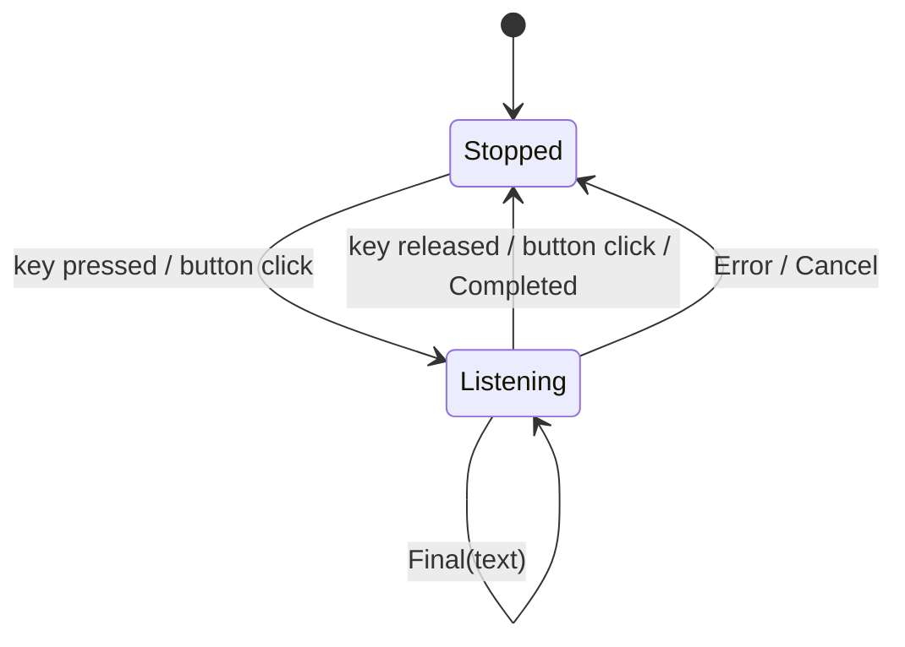

# Windows 实时语音转写替换计划

## 背景

当前语音输入是批处理链路：`crates/voice_input/src/lib.rs:136` 用 `cpal` 打开麦克风并缓存音频帧，`stop_listening` 在 `crates/voice_input/src/lib.rs:269` 暂停录音并把缓存转成 WAV base64，随后 app 层调用 `app/src/voice/transcriber.rs:32` 的 `Transcriber::transcribe(wav_base64)`，Windows 后端再由 `crates/voice_transcription/src/imp/windows.rs:17` 写临时 WAV 文件并交给 SAPI 识别。

目标是用 Windows WinRT `windows::Media::SpeechRecognition` 连续识别 API 替换这条“录音 -> WAV -> SAPI 批量转写”链路。新的用户交互规则是：

- 按住触发键：开始实时转写；松开触发键：结束本次转写。
- 点击麦克风按钮：开始实时转写；再次点击按钮：结束本次转写。
- 转写期间实时接收 hypothesis/final 文本，不再等录音结束后统一转写。

## 当前关键入口

- `crates/voice_input/src/lib.rs:32` — `VoiceInputState` 持有 `cpal::Stream`、重采样器、WAV 结果 channel。
- `crates/voice_input/src/lib.rs:57` — `VoiceSessionResult::Audio { wav_base64, ... }` 是现有 app 层和转写层的边界。
- `app/src/editor/view/voice.rs:202` — 编辑器输入框语音按钮和按键触发主逻辑。
- `app/src/editor/view/voice.rs:408` — 收到 WAV 后启动 `Transcriber::transcribe`，再一次性插入文本。
- `app/src/ai/blocklist/agent_view/agent_input_footer/mod.rs:1455` — CLI agent footer 语音触发逻辑。
- `app/src/ai/blocklist/agent_view/agent_input_footer/mod.rs:1533` — CLI agent footer 收到 WAV 后转写并插入。
- `app/src/lib.rs:1534` — 注册 `voice_input::VoiceInput` 和 `VoiceTranscriber` singleton。
- `crates/voice_transcription/Cargo.toml:14` — Windows 依赖当前只打开 Win32 SAPI/COM feature，没有打开 WinRT SpeechRecognition。

## 目标架构

把语音系统拆成两层：

1. `voice_transcription` 负责系统实时转写会话。
2. app 层的 `VoiceInput` 只负责用户触发状态、会话生命周期和事件转发，不再录音、不再生成 WAV。

Windows 实现使用这些 WinRT API：

- `SpeechRecognizer::new()`
- `SpeechRecognizer::CompileConstraintsAsync()`
- `SpeechRecognizer::ContinuousRecognitionSession()`
- `SpeechRecognizer::HypothesisGenerated(...)`
- `SpeechContinuousRecognitionSession::ResultGenerated(...)`
- `SpeechContinuousRecognitionSession::Completed(...)`
- `SpeechContinuousRecognitionSession::StartAsync()`
- `SpeechContinuousRecognitionSession::StopAsync()`
- `SpeechContinuousRecognitionSession::CancelAsync()`
- `SpeechRecognizer::Close()`

## 新增转写抽象

在 `crates/voice_transcription` 新增实时会话 API，替代现有 batch-only `SystemSpeechRecognizer::transcribe_wav_*` 作为 app 主路径。

建议类型：

```rust
pub struct RealtimeSpeechRecognizer;

pub struct RealtimeSpeechSession {
    // Windows: 持有 SpeechRecognizer、SpeechContinuousRecognitionSession、
    // event token、event receiver。
}

pub enum RealtimeSpeechEvent {
    Hypothesis { text: String },
    Final { text: String },
    Completed,
    Canceled,
    Error(Error),
}
```

建议方法：

```rust
impl RealtimeSpeechRecognizer {
    pub fn new() -> Result<Self>;
    pub async fn start_session(&self) -> Result<RealtimeSpeechSession>;
}

impl RealtimeSpeechSession {
    pub fn events(&self) -> async_channel::Receiver<RealtimeSpeechEvent>;
    pub async fn stop(self) -> Result<()>;
    pub async fn cancel(self) -> Result<()>;
}
```

实现细节：

- Windows 后端新增 `crates/voice_transcription/src/imp/windows_realtime.rs`。
- `windows` feature 增加 `Media_SpeechRecognition`，按编译需要补 `Foundation`、`Globalization`、`Foundation_Collections`。
- WinRT async action 用当前 `windows` 0.62.2 生成的 `windows_future` 类型等待完成，不在 UI 线程阻塞。
- `HypothesisGenerated` 发送临时文本，`ResultGenerated` 只在 `SpeechRecognitionResultStatus::Success` 时发送 final 文本；其他 status 映射到 `Error` 或 `Completed`。
- 保存 `HypothesisGenerated`、`ResultGenerated`、`Completed` 返回的 event token，`stop/cancel/drop` 时移除 handler 并 `Close()`。
- 回调来自系统线程，只通过 channel 发事件；不得直接操作 WarpUI entity。

## app 层替换

### `VoiceInput` singleton

重写 `crates/voice_input/src/lib.rs` 的职责：

- 保留 `VoiceInputToggledFrom`、`StartListeningError`、会话时长统计、`should_suppress_new_feature_popup`。
- 删除或停用 `cpal::Stream`、`rubato` 重采样、`hound` WAV 生成、`VoiceSessionResult::Audio { wav_base64, ... }`。
- 新状态改为：

```rust
pub enum VoiceInputState {
    Idle,
    Listening {
        enabled_from: VoiceInputToggledFrom,
        session_start: instant::Instant,
        stop_tx: ...,
    },
}
```

- `start_listening` 改为启动 `RealtimeSpeechRecognizer::start_session()`，返回一个 `VoiceSession`，该 session 暴露实时事件流。
- `stop_listening` 改为调用 realtime session 的 `stop()`，发送 `Completed`。
- `abort_listening` 改为调用 realtime session 的 `cancel()`，发送 `Canceled`。
- 删除 `set_transcribing_active` 或把它变成兼容空操作；实时链路没有单独的“录音结束后转写中”阶段。

### 编辑器语音 UI

修改 `app/src/editor/view/voice.rs`：

- `VoiceInputState` 简化为 `Stopped | Listening { handle }`，去掉 `Transcribing` 分支和 dots loading 状态。
- 按键触发：
  - `Stopped + Pressed`：开始 session。
  - `Listening + Released`：停止 session。
  - `Stopped + Released`、`Listening + Pressed`：忽略。
- 按钮触发：
  - `Stopped + Button`：开始 session。
  - `Listening + Button`：停止 session。
- `handle_voice_session_result` 替换为 `handle_voice_event`：
  - `Hypothesis`：更新一段临时转写文本。
  - `Final`：提交文本到 editor buffer，并清空对应临时文本。
  - `Completed/Canceled/Error`：结束 UI listening 状态，必要时 toast。

临时文本处理建议：

- 第一阶段只把 final 文本插入 buffer，hypothesis 只更新 UI 状态，不修改 buffer，避免频繁插入/回滚造成光标和 undo 栈复杂化。
- 如果需要肉眼可见的“实时转写”，在输入框内用现有 voice cursor/placeholder 区域展示 hypothesis，而不是写入真实 editor buffer。
- 第二阶段再考虑把 hypothesis 作为 ghost text 或独立 overlay 展示。

### CLI agent footer

修改 `app/src/ai/blocklist/agent_view/agent_input_footer/mod.rs`：

- `CLIVoiceInputState` 简化为 `Stopped | Listening`，去掉 `Transcribing`。
- 点击按钮开始/结束；按键按下开始、松开结束。
- final 文本继续走现有 `InsertIntoCLIRichInput` / PTY 输入路径。
- hypothesis 暂时只更新 footer 的临时状态或按钮 tooltip/status，不直接写入 CLI rich input。

### app singleton 注册

修改 `app/src/lib.rs:1534` 附近：

- 不再注册 `VoiceTranscriber` 作为 batch 转写器主入口。
- 注册新的实时系统转写服务，例如 `VoiceRealtimeTranscriber` 或让 `VoiceInput` 内部持有 `RealtimeSpeechRecognizer`。
- `TranscriptionBackend::System` 在 Windows 上映射到 WinRT realtime 后端。
- `Local` / `Api` 后端目前不是实时 API，先禁用或隐藏，避免用户选择后没有可用转写器。

## 清理和依赖

- `crates/voice_input/Cargo.toml` 移除不再使用的 `cpal`、`hound`、`rubato`，如果该 crate 只剩状态机和 app entity，可考虑并入 app 层；第一版先保留 crate，降低改动面。
- `crates/voice_transcription/src/imp/windows_sapi/*` 暂时保留到新链路稳定后再删；主路径不再调用。
- `app/src/voice/transcriber.rs` 的 batch `Transcriber` trait 可先保留但不再注入；后续统一删除 `VoiceTranscriber`、`SystemSpeechRecognizerAdapter` 和 `TranscribeError::QuotaLimit` 等云端批量转写遗留语义。
- 设置文案从 “transcribed to text” 调整为系统实时转写语义；如果保留 backend dropdown，未实现项必须 disabled。

## 状态流



## 实施步骤

1. 在 `voice_transcription` 增加 Windows WinRT realtime smoke example，能启动会话、打印 hypothesis/final、停止会话。
2. 增加 `RealtimeSpeechRecognizer` / `RealtimeSpeechSession` 抽象和 Windows 实现。
3. 重写 `voice_input::VoiceInput` 状态机，让它启动/停止 realtime session，并把事件流暴露给 app 层。
4. 改编辑器语音逻辑：按钮点击切换开始/结束，按键按下开始、松开结束，final 文本插入 editor。
5. 改 CLI agent footer：复用同一 session 事件流，final 文本插入 CLI 输入。
6. 调整设置页和 singleton 注册，避免 batch 后端继续作为主路径。
7. 删除或隔离未使用的录音/WAV 依赖，跑 `cargo check`。

## 验证计划

- Windows 手工验证：
  - 点击麦克风按钮开始，按钮变成停止态；再次点击停止。
  - 按住配置的触发键开始，松开立即停止。
  - 说话时能收到 hypothesis/final 日志或 UI 状态。
  - final 文本进入编辑器输入框。
  - CLI agent footer final 文本进入 CLI 输入。
  - 麦克风权限关闭时显示现有麦克风访问错误 toast。
- 自动验证：
  - 给 `voice_input` 状态机加单元测试，覆盖按键 pressed/released 和按钮 toggle。
  - 给编辑器/CLI footer 加事件处理测试，覆盖 `Hypothesis` 不写入 buffer、`Final` 写入 buffer、`Error` 结束 listening。
  - `cargo check` 作为提交前必要验证。

## 风险

- WinRT continuous recognition 依赖 Windows 麦克风权限和系统语音识别设置；需要在真实 Windows 桌面环境验证，CI 很难覆盖。
- 语言支持和中文识别质量取决于系统已安装语言包和 Online speech recognition 设置；第一版应把错误状态明确暴露到日志/toast。
- WinRT 事件回调线程不能直接更新 UI；必须通过 channel 回到 WarpUI context。
- 如果用户希望 hypothesis 直接出现在真实输入框，会涉及 undo、selection、composition 和 final 替换策略；第一版应只展示 hypothesis，不提交到真实 buffer。

## 复核结果

当前实现已按本计划完成主要替换：

1. `voice_transcription` 已新增 realtime 抽象、Windows WinRT 实现和 smoke example，并保留非 Windows fallback，避免 `voice_input` 破坏非 Windows 构建。
2. `voice_input` 已改为 realtime session 状态机，不再录音、不再生成 WAV；开始会话走 `ModelContext::spawn`，停止/取消走内部控制 channel，并向 app 层暴露 `VoiceSessionEvent` 流。
3. 编辑器语音入口已改为按钮/按键开始和停止 session；`Hypothesis` 不写入 buffer，`Final` 写入 editor，`Completed` / `Canceled` / `Error` 结束 listening 状态。
4. CLI agent footer 已删除 `Transcribing` 状态和 batch 转写 future；final 文本继续写入 CLI rich input 或 PTY，hypothesis 只记录日志。
5. app 初始化不再注入可用的 batch `VoiceTranscriber`；settings 后端下拉只显示 realtime 可用的 `System`，Local/API 暂不作为可选主路径。
6. 录音/WAV 相关 `cpal`、`hound`、`rubato` 依赖已从 `voice_input` 清理。

已通过验证：

- `cargo check -p voice_input`
- `cargo check -p voice_transcription --example realtime_smoke`
- `cargo check -p warp --features voice_input`

仍需真实 Windows 桌面手工验证：

- 点击麦克风按钮开始，按钮变成停止态；再次点击停止。
- 按住配置的触发键开始，松开立即停止。
- 说话时能收到 hypothesis/final 日志或 UI 状态。
- final 文本进入编辑器输入框。
- CLI agent footer final 文本进入 CLI 输入。
- 麦克风权限关闭时显示现有麦克风访问错误 toast。
